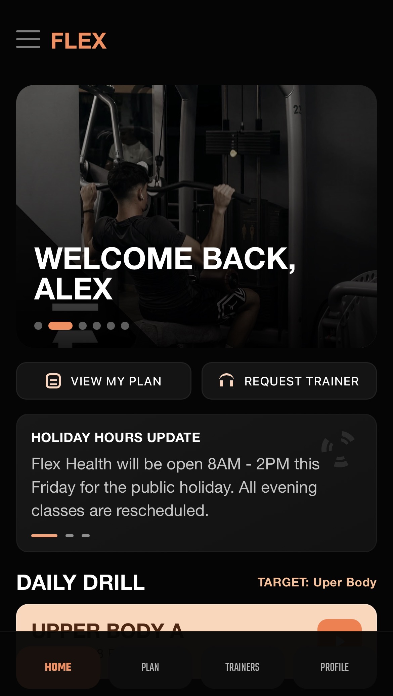
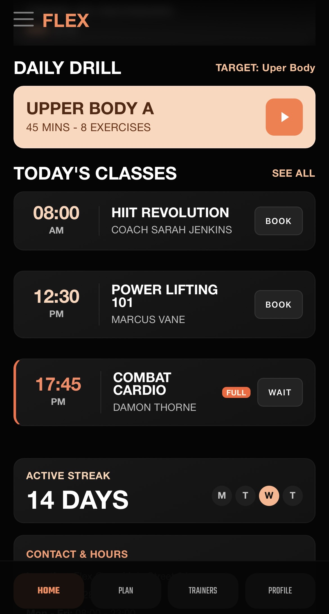
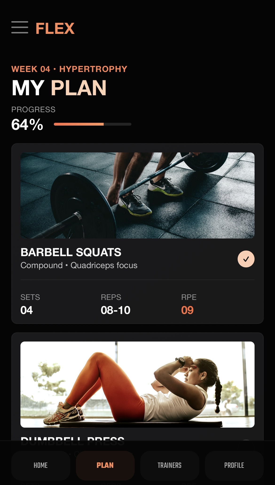

# FlexApp

This project was generated using [Angular CLI](https://github.com/angular/angular-cli) version 21.2.5.

## Project Status

This application is in **production stage** (production-ready build and setup), but it is **not publicly released yet**.

## About This Project

FlexApp is being built for a **local gym** to support members and trainers with training plans, schedules, and profile management in one place.

## Screenshots

<p align="center">
	
	
	
	
</p>


## Development server

To start a local development server, run:

```bash
ng serve
```

Once the server is running, open your browser and navigate to `http://localhost:4200/`. The application will automatically reload whenever you modify any of the source files.

